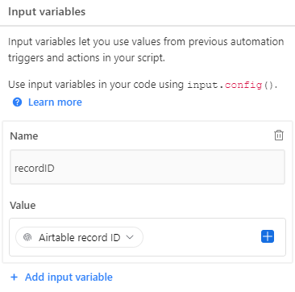

### 01 AIRTABLE AUTOMATION SEND WEBHOOK

This picture explains how to configure input.config() to take the Id of the record and sending it through a Webhook

The Id came from the record that activate the automation

In my case I send the webhook to make where I have automated several tasks depending on the base or interface the execution came from

